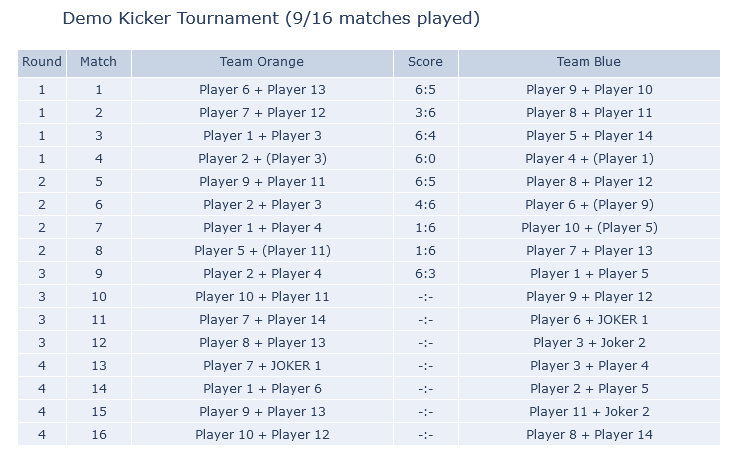
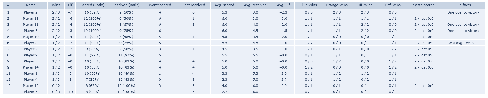
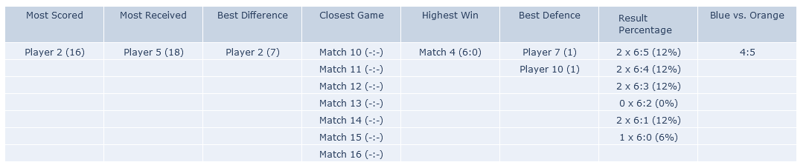

# Kicker-Tournament

A python based Kicker Tournament planner and handler with a nice html match plan, scores and trivia.

Enjoy!

### Description
Check the `demo.py` file in the tournaments folder to see how to set up a tournament.

### Steps
 - Add Player names (currently up to 16)
 - Modify the rounds if desired (not recommended)
 - If you do not have 16 players, but also more than 8, you can fill up with Jokers.
 - Jokers need to be assigned per match and the Joker scores do not count for the player that are Jokers.
 - If you have 8 or less players, or more than 16, please check https://golfsoftware.com/tools/schedule/playall.html to generate a new hard coded match plan for those cases.
 - Match plans always have to be dividable by 4. Also if you want more rounds of matches, please generate a new plan via the link.
 - Run the script.
 - Open the results html file from PyCharm by right clicking and select open in browser.

### Tips
 - Best setup is 2 screens: One to edit the demo.py or renamed match script, one to show the automatically updating results html file that will always show the current results and next matches.

### Screenshots

#### Score

#### Table

#### Trivia

### About
Developed by Marc Engelmann
